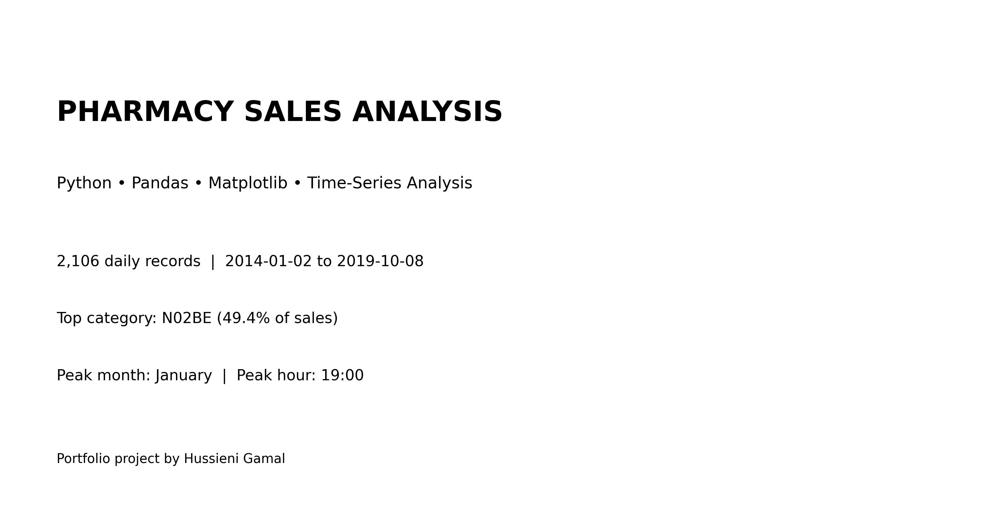
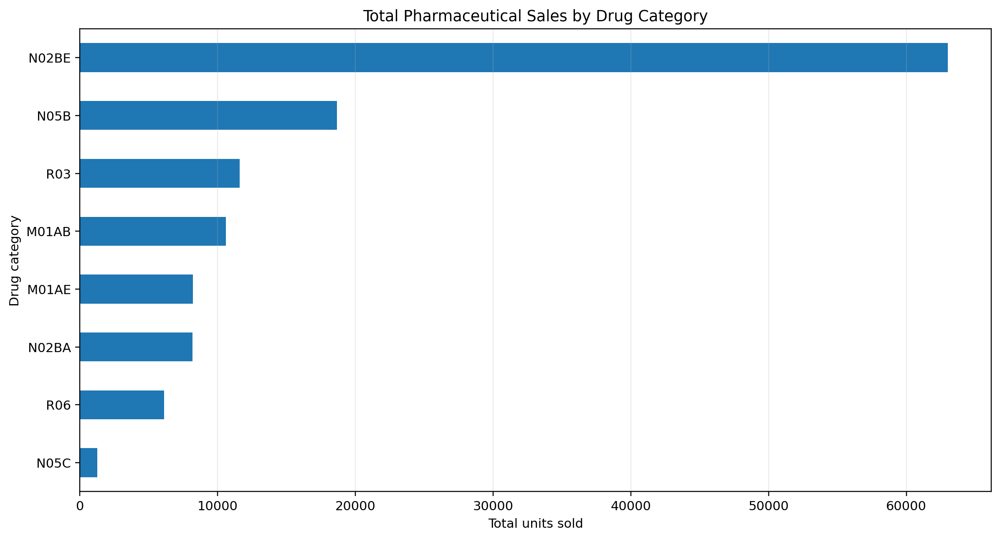
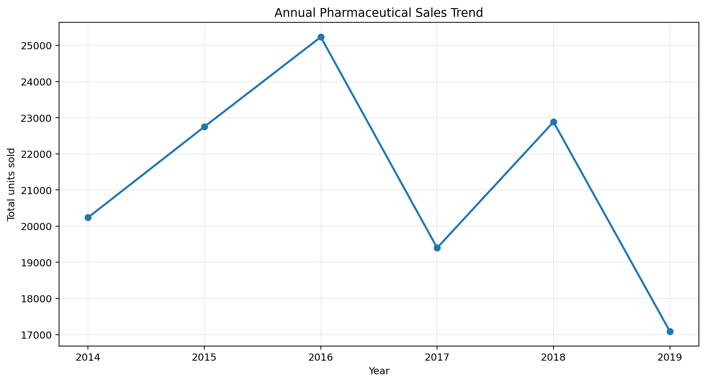
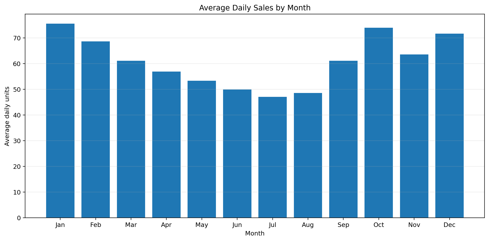
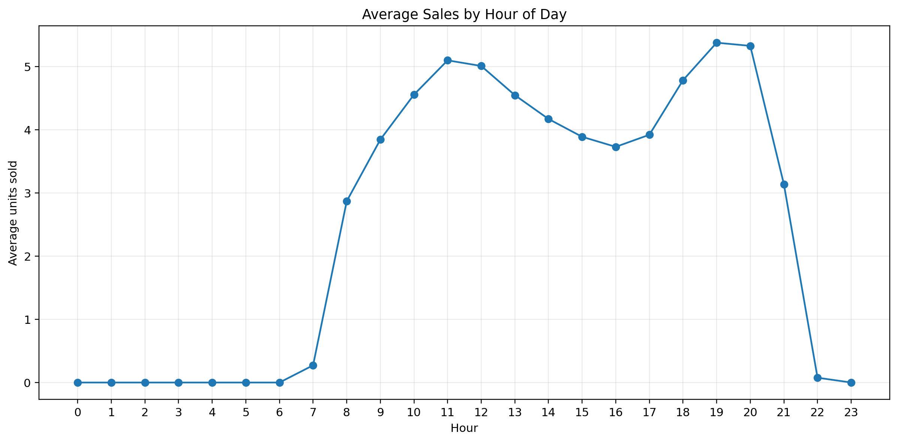
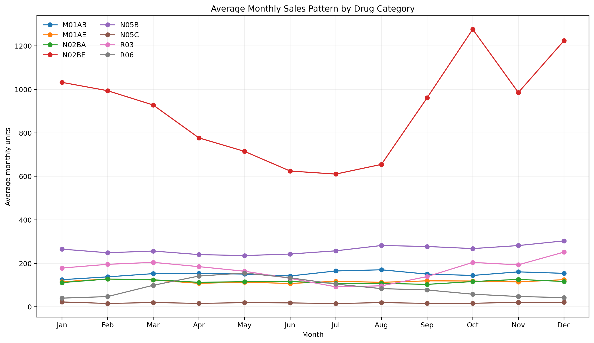
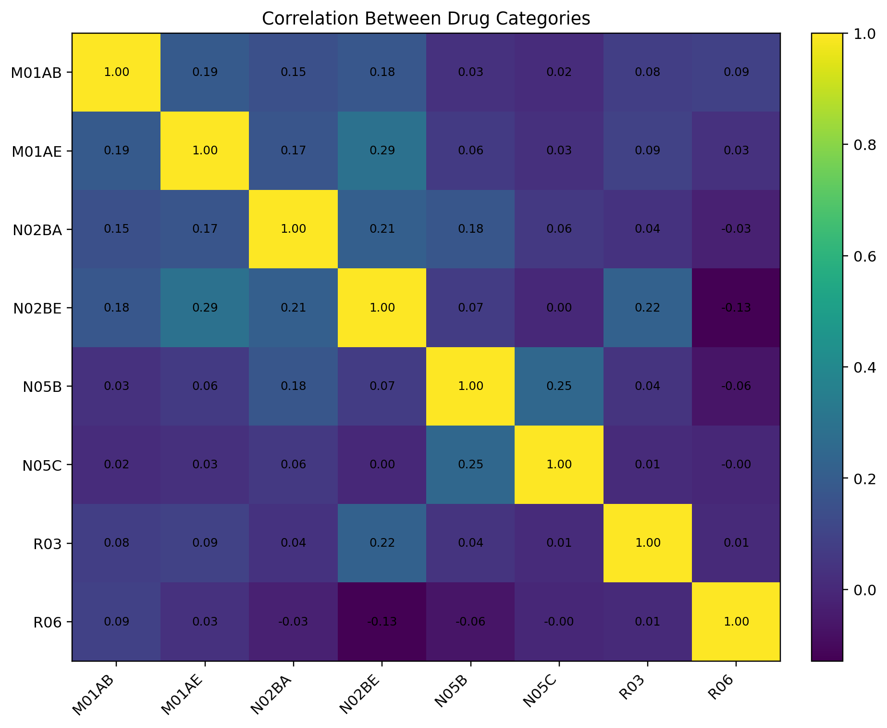

# 💊 Pharmacy Sales Analysis | Python

A portfolio-ready **exploratory data analysis project** examining multi-year pharmaceutical sales across daily, weekly, monthly, and hourly datasets.

The project uses Python to clean data, engineer time-based features, compare drug-category performance, identify seasonality, and translate analytical findings into practical business insights.

<p align="center">
  
</p>

<p align="center">
  <a href="notebook/pharmacy_sales_analysis.ipynb">
    
  </a>
  <a href="DATA_DICTIONARY.md">
    
  </a>
</p>

## 📊 Project Snapshot

- **2,106 daily records** covering **2014-01-02 to 2019-10-08**
- **50,532 hourly records**
- **8 pharmaceutical categories**
- Daily, weekly, monthly, annual, weekday, and hourly analysis
- Reproducible Jupyter Notebook
- Cleaned datasets and high-resolution charts included

## 🎯 Business Questions

1. Which pharmaceutical categories generate the highest sales?
2. How did sales change across the available years?
3. Which months show the strongest and weakest demand?
4. Are there clear weekday or hourly purchasing patterns?
5. Which categories exhibit distinct seasonal behavior?
6. How can daily performance be classified into low, medium, and high bands?
7. Which drug categories move together?

## 💡 Key Findings

| Finding | Result |
|---|---|
| Leading category | **N02BE — Paracetamol / Analgesics** |
| Share of total sales | **49.4%** |
| Strongest year | **2016** |
| Peak month | **January** |
| Lowest-demand month | **July** |
| Strongest weekday | **Saturday** |
| Peak hour | **19:00** |

## 🧠 Analysis Workflow

1. Loaded and inspected four time-granularity datasets.
2. Validated data types, missing values, and analytical fields.
3. Converted date fields and derived year, month, quarter, and weekday attributes.
4. Calculated total sales across eight pharmaceutical categories.
5. Built annual, monthly, weekday, and hourly analyses.
6. Classified daily sales using percentile-based performance bands.
7. Examined correlations between pharmaceutical categories.
8. Exported a cleaned dataset for reuse.

## 📈 Selected Visualizations

### Category Performance
<p align="center"></p>

### Annual Sales Trend
<p align="center"></p>

### Monthly Seasonality
<p align="center"></p>

### Hourly Demand Pattern
<p align="center"></p>

### Category Seasonality
<p align="center"></p>

### Category Correlation
<p align="center"></p>

## 🛠️ Tools & Skills

`Python` `Pandas` `NumPy` `Matplotlib` `Jupyter` `EDA` `Feature Engineering` `Time-Series Aggregation` `Correlation Analysis` `Data Storytelling`

## ▶️ Run Locally

```bash
git clone https://github.com/HussieniGamal/Pharmacy-Sales-Analysis-Python.git
cd Pharmacy-Sales-Analysis-Python
pip install -r requirements.txt
jupyter notebook notebook/pharmacy_sales_analysis.ipynb
```

## 📁 Repository Structure

```text
Pharmacy-Sales-Analysis-Python/
├── data/
├── images/
├── notebook/
│   └── pharmacy_sales_analysis.ipynb
├── DATA_DICTIONARY.md
├── project_summary.csv
├── requirements.txt
├── .gitignore
└── README.md
```

## 📚 Dataset

The raw files correspond to the public **Pharma Sales Data** dataset. Drug categories follow ATC classification codes.

## 👤 Author

**Hussieni Gamal**  
Data Analyst | Business Intelligence | Power BI | SQL | Excel | Python

[LinkedIn](https://www.linkedin.com/in/hussieni-gamal-549b68134/) • [GitHub Profile](https://github.com/HussieniGamal) • [Portfolio](https://sites.google.com/view/hussienigamal/home)
